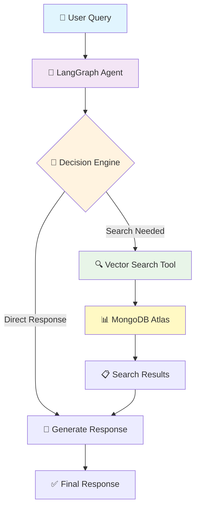

# 🛒 AI Agent with LangGraph.js & MongoDB

## not just a chatbot that responds, but an intelligent system that autonomously:

- 🧠 **Thinks**: Analyzes customer queries and decides the best action
- 🔍 **Acts**: Searches real product databases using vector embeddings  
- 🔄 **Adapts**: Falls back to alternative search strategies when needed
- 💭 **Remembers**: Maintains conversation context across interactions

---

## 📚 What I'd Learn

<table>
<tr>
<td width="50%">

### 🏗️ **Core Concepts**
- ✨ **Agentic AI Architecture**
- 🗃️ **MongoDB Atlas Vector Search**
- 🌊 **LangGraph Workflow Orchestration**
- 💬 **Conversational State Management**

</td>
<td width="50%">

### 🛠️ **Practical Skills**
- 🔗 **API Integration** (OpenAI & Gemini)
- ⚛️ **React Frontend Development**
- 🌐 **RESTful API Design**
- 📊 **Database Seeding & Management**

</td>
</tr>
</table>

---

## 🏗️ Architecture Overview

---

## 🌟 Key Features

<table>
<tr>
<td width="33%">

### 🧠 **Intelligent Decision Making**
- Autonomous tool selection
- Context-aware responses
- Multi-step reasoning

</td>
<td width="33%">

### 🔍 **Advanced Search**
- Vector semantic search
- Text fallback search
- Real-time inventory lookup

</td>
<td width="33%">

### 💬 **Natural Conversations**
- Conversation memory
- Thread-based persistence
- Human-like interactions

</td>
</tr>
</table>

---

## 🎯 What Makes This "Agentic"?

Unlike traditional chatbots, our AI agent:

| 🤖 **Traditional Chatbot** | 🧠 **Our Agentic System** |
|---------------------------|---------------------------|
| Pre-programmed responses | Dynamic decision making |
| Static information | Real-time database queries |
| Single-turn interactions | Multi-step autonomous actions |
| No tool usage | Custom tool integration |
| Can't adapt to failures | Intelligent fallback strategies |

---

